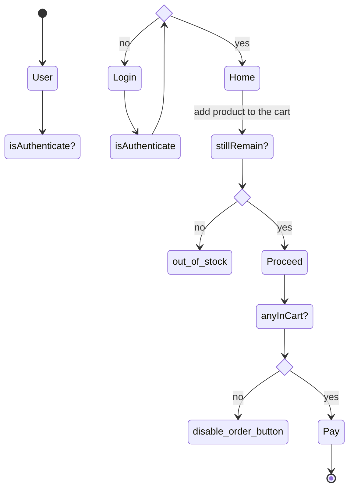
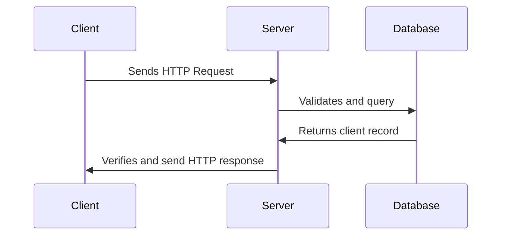

# let's planning before coding
1. Understand and defined a problem; what am I going to build?
2. Set the goal; what should my program receive as an input and what output should it return
3. Break it down into smaller pieces
4. Identify state/data; what information should my program remember;
5. Design flow; what should happen first,second,third ...
6. Consider edge case;
7. Write psudo code

## What am I going to build
I want to build simple shopping page

## What should be the input and output data
- Login card (/auth)
receive: username, password
return: HTTP status and message

- Register card (/auth)
receive: email, username, password, country_code, phone-number, zip-code
return: HTTP status and message

- Home Page (/home)
receive: trending, reccommend products img-url, username, profile-url
return: demonstrate the product-image, username, user-profile

- Shopping page (/shop)
receive: products number-in-stock, img-url, price, rating data
return: number-in-stock, product-img, price, rating

- Hidden side-bar (/shop)
receive: img-url, quantity, price
return: product-img, quantity, total-price

## Break down each stage into smaller piece
### User authentication system
#### Login
- check is user authenticated (cookie and jwt)
- is authenticated? yes: --redirect--> home; no: --redirect--> login
- verify username, password; is it the exact same in db?

#### Register
- receive user input and check if a user already exist? yes: --return--> user already exist; no --insert data--> db
- after register is complete redirect to login session

### CRUD
- create cartItem, whishlist
- read cartItem
- update, patch cartItem quantity, whishlist or their username
- delete cartItem

#### API
- fetch products API data from external source *must contain: product_name, quantiti, price, img-url, rating
- use async, await to catch promise

### Database
- use pg to connect and migrate simeple user, order table

## must remember state
- isAuthenticated

## Design flow

## Edge case
### authentication
- !require field for registeration
- user already exist
- !require field for authenticatio
- user do not exist
- wrong password
- malformed request
- database unavaliable
- network error

### object level authorization
- credential exposed in url
- IDOR/BOLA change user_id in url to access other people data
- broken access control/authorization failure User can perform action that aren't allowed
- user can see another user private data

### jwt and cookie
- wrong token, no token
- expired session

required module
- http ,pg, bcrypt, cookie